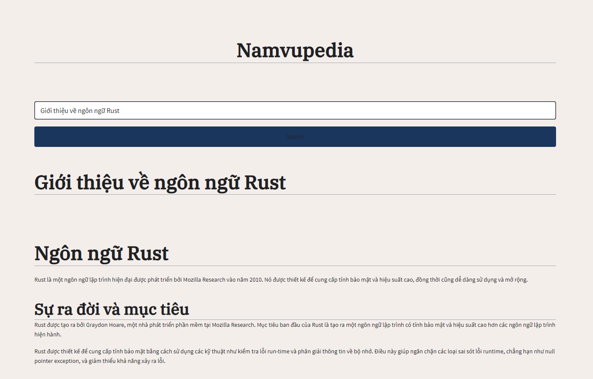

# Dr. Biết Tuốt

[](https://justforfunnoreally.dev)



This Streamlit app provides a Wikipedia-like interface for querying an OLLAMA language model. Users can input their queries, and the app will generate informative responses using the configured OLLAMA model.

## Setup

1. Install the required dependencies:
   ```
   pip install -r requirements.txt
   ```

2. Configure the `.env` file with your OLLAMA API URL and model name (copy the `env.example` file to `.env` and modify it).

3. Run the Streamlit app:
   ```
   streamlit run src/main.py
   ```

4. Open your web browser and navigate to the URL provided by Streamlit (usually `http://localhost:8501`).

## Tips

- You can use the `Dr. Biết Tuốt.desktop` or `Dr. Biết Tuốt.bat` files to run the app. This provides a terminal window for the app and an easy way to launch it with a double-click.

## Usage

1. Enter your query in the text area provided.
2. Click the "Submit" button to generate a response.
3. The app will display the OLLAMA-generated response in a Wikipedia-like format.

## Configuration

- Modify the `system_prompt.txt` file to change the system prompt sent to the OLLAMA model.
- Update the `.env` file to change the OLLAMA API URL or model name.
